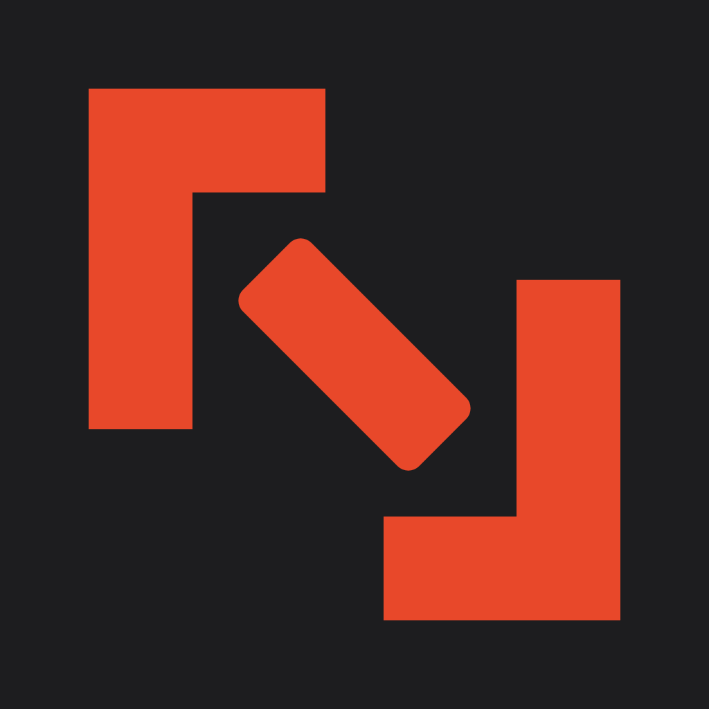
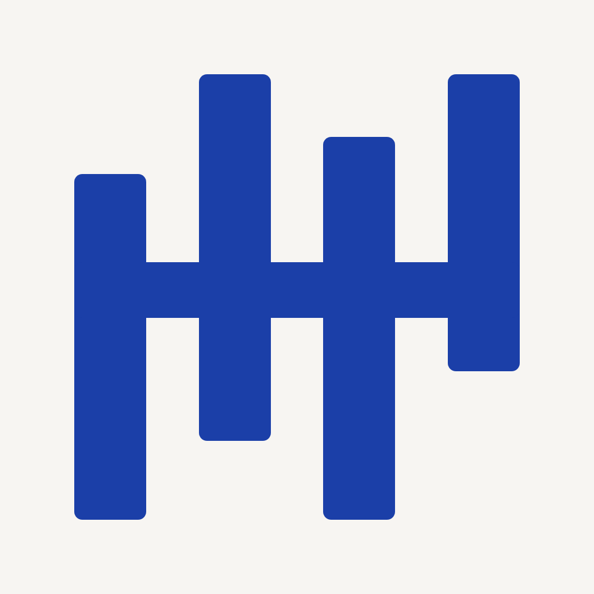
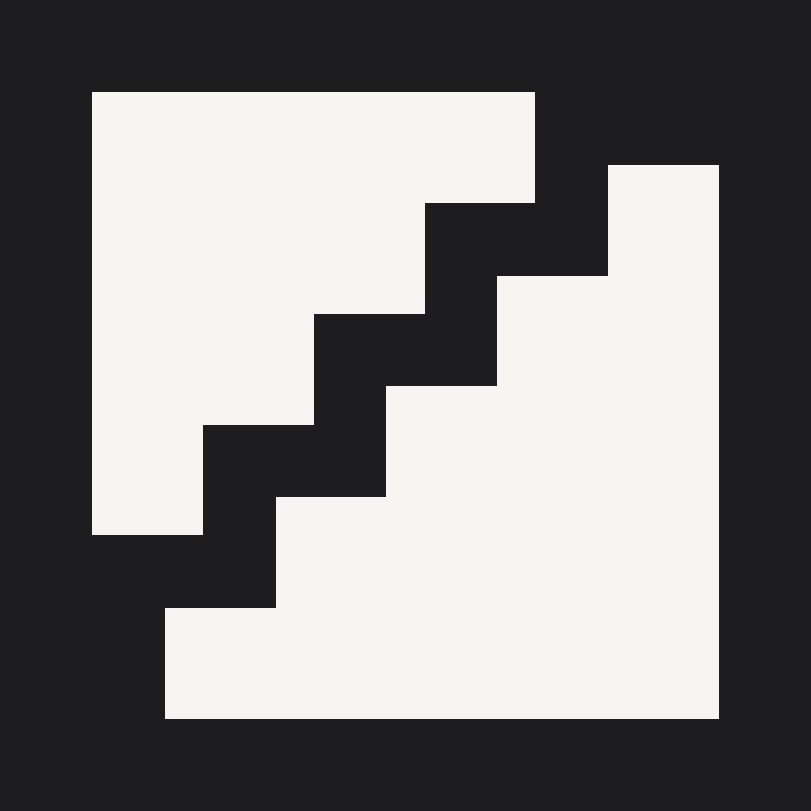

# RunTeams.ai Logo — Round 1

Claude Design project: `RunTeams.ai Logo R1`
Project ID: `0bf89daa-4026-40b3-ace3-4ef6b6360582`

This round is decision material. It explores three different memory hooks before production refinement of one selected direction.

## Brand brief

- Product: a local-first control plane that organizes mature Agent Runtimes into reusable AI teams.
- Audience: independent builders, founders, small-team operators, and automation-heavy users.
- Tone: restrained, intelligent, dependable, calm, modern, and operational rather than magical.
- Primary contexts: macOS/iOS app icon, 16–32 px favicon, web navigation lockup, product loading states, GitHub/social avatar, monochrome and reverse use.
- Rejected category clichés: sparkles, robots, brains, neural-network dots, infinity loops, hexagons, stacked three bars, play buttons, ordinary arrows, and purple-blue gradients.

## 01 — Relay / 接力编织

- Architecture: abstract gesture with a possible letterform reading.
- Mark logic: two open role posts face each other while a baton crosses the gap. The remembered moment is the hand-off, not an arrow.
- Colors: warm black `#1D1D1F`, signal vermilion `#E8482A`.
- Wordmark: Instrument Sans 600 with tight optical tracking; `.ai` is demoted in tone and weight.
- Signals: action, continuity, human hand-off, momentum.
- Rejects: passive workflow diagrams and generic AI symbolism.
- Application strength: strongest brand story and warmest emotional read; works well as a Dock icon and motion mark.
- Risk to refine: the two corner forms can briefly read as crop/expand brackets. Round 2 should make the role-post construction more ownable while preserving the baton.
- Small-size result: passes at 60 px and remains identifiable at 16 px; the baton is still visible.

## 02 — Team Operating Grid / 团队运行格

- Architecture: geometric reduction.
- Mark logic: four independent role lanes cross one shared control rail. Each lane starts and ends independently while the rail keeps the team in phase.
- Colors: warm white `#F7F5F2`, deep cobalt `#1B3FA8`.
- Wordmark: Instrument Sans 600 with tight optical tracking; `.ai` is demoted in tone and weight.
- Signals: orchestration, reliability, system discipline, multiple workers under one operating layer.
- Rejects: anthropomorphic team illustrations and decorative AI marks.
- Application strength: cleanest light-background implementation and strongest operational-system read.
- Risk to refine: can read as an audio waveform, mixer, tally, or fence. It is the least distinctive candidate in this round.
- Small-size result: passes at 60 px and 16 px; the alternating lane rhythm survives.

## 03 — Command Cadence / 指挥节拍

- Architecture: geometric reduction with modular negative space.
- Mark logic: two modules mesh along a five-step seam, offset by one beat. The seam represents command cadence and staged hand-off.
- Colors: warm black `#1D1D1F`, warm white `#F7F5F2`.
- Wordmark: Instrument Sans 600 with tight optical tracking; `.ai` is demoted in tone and weight.
- Signals: precision, control, progression, software-native construction.
- Rejects: soft AI magic and generic collaboration circles.
- Application strength: strongest monochrome silhouette and simplest reproduction system.
- Risk to refine: the staircase can read as pixels, a growth chart, or a circuit trace; it feels more technical and less human than Relay.
- Small-size result: strongest 16 px result; the diagonal cadence remains readable as a compact pixel silhouette.

## Recommendation

Advance **01 Relay** if RunTeams.ai should feel memorable, active, and centered on Agent hand-offs. Advance **03 Command Cadence** if it should feel stricter, more technical, and closer to infrastructure. Keep **02 Team Operating Grid** only if the operational-system metaphor matters more than distinctiveness.

## Round 2 after selection

1. Refine the selected symbol geometry and remove its documented ambiguity.
2. Produce horizontal, stacked, symbol-only, monochrome, and reverse lockups.
3. Redraw and outline the wordmark for production instead of depending on a live font.
4. Test actual macOS Dock, iOS icon masks, Safari/Chrome favicon rendering, dark mode, and 1-color printing.
5. Export production SVG, PDF, transparent PNG sizes, favicon assets, and app-icon source.
