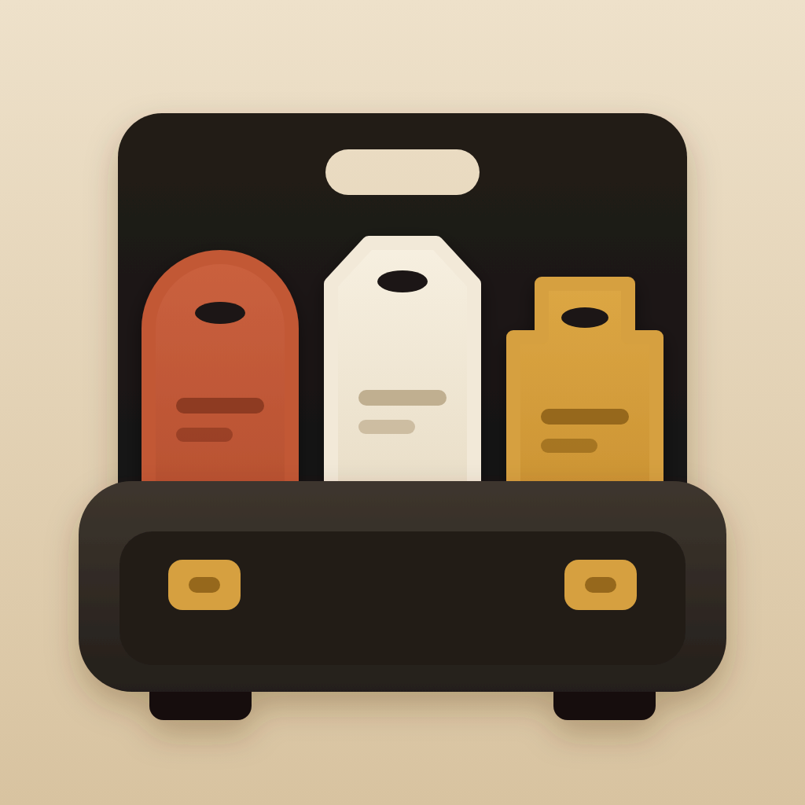
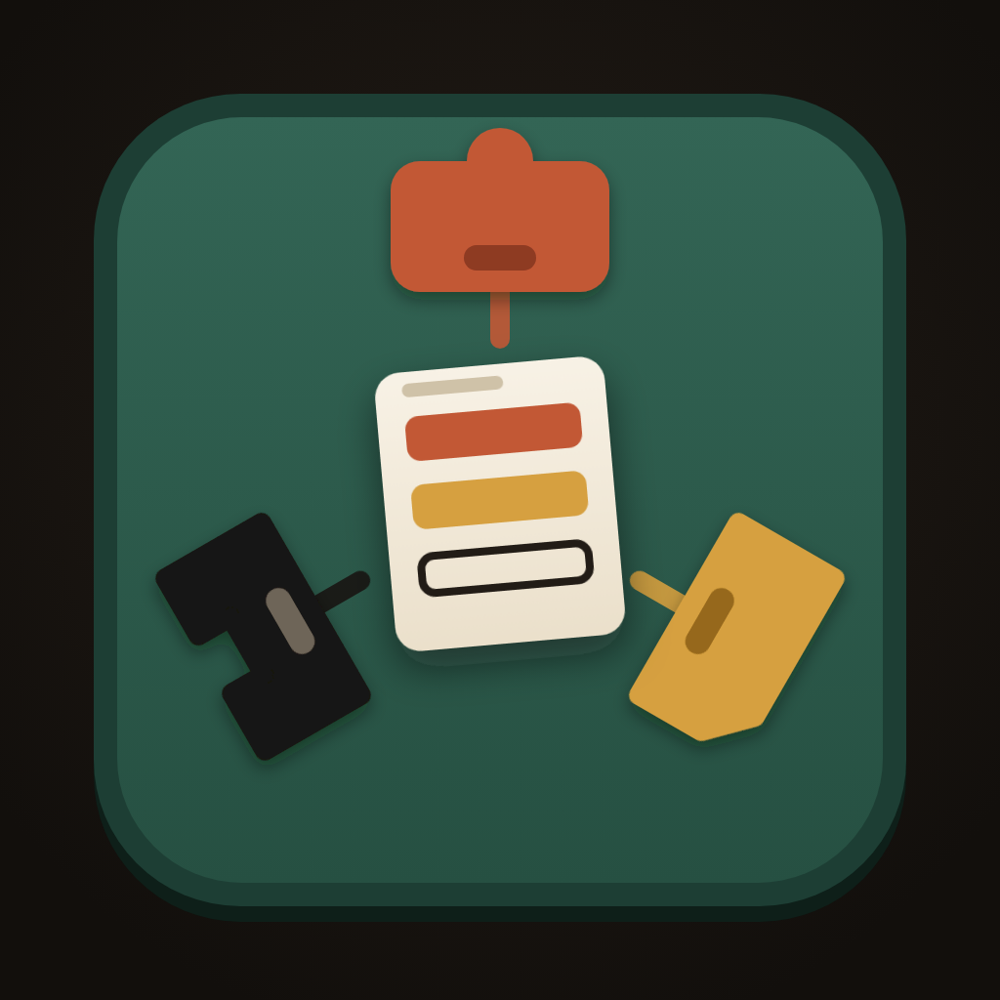
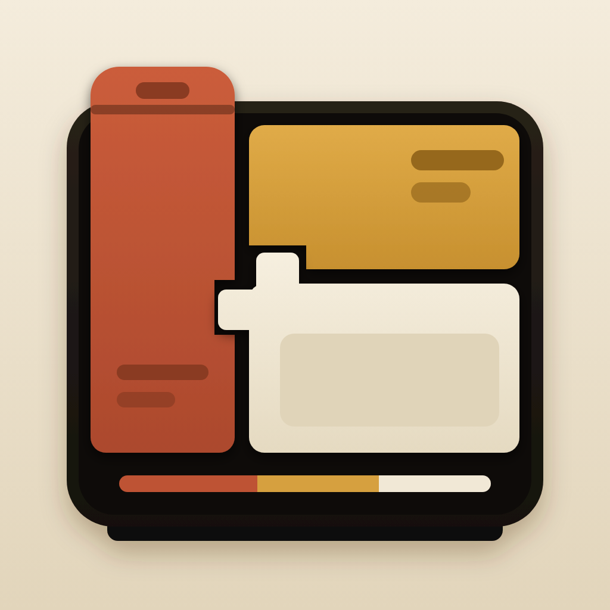

# RunTeams.ai Logo — Round 2 App Icon Exploration

Claude Design project: `RunTeams.ai Logo R2`
Project ID: `d3364597-ddef-4cb5-993d-980d1e0109c3`

Round 1 was rejected because its abstract geometry felt like generic B2B SaaS branding. Round 2 changes the architecture from abstract symbol-first to tangible object/scene-first, matching the original app pipeline's stronger icon language.

## 01 — Team Case / 团队工具箱

- Visual hook: three differently shaped role tags organized inside one sturdy portable case.
- Signals: a prepared team, roles kept together, a dependable tool you can carry and run.
- Strength: clearest single-object silhouette and strongest warm desktop-tool personality.
- Risk: the handle and case construction can imply luggage or travel. A refinement should shift the case toward a purpose-built work console without losing the recognizable silhouette.
- Small size: passes at 60 px and 16 px; the three role tags remain visible.

## 02 — Shared Table / 共享工作台

- Visual hook: three distinct work positions surrounding one central task sheet.
- Signals: one task, multiple roles, coordinated work and visible human intervention.
- Strength: tells RunTeams' collaboration story most directly and feels least like infrastructure branding.
- Risk: the top-down scene can read as a board game or meeting table. A refinement should make the three positions feel more like capable tools/agents and less like game pieces.
- Small size: passes at 60 px and 16 px; the central task sheet stays dominant.

## 03 — Company Stack / 公司装置

- Visual hook: three differently shaped role modules fitted into one dark operating chassis.
- Signals: heterogeneous Agent Runtimes organized into one stable control plane.
- Strength: closest to the product architecture and the most compact dark/light object system.
- Risk: still has some dashboard or device-UI character and could read as a generic control console. Refinement should make the module fit more physical and ownable.
- Small size: passes at 60 px and 16 px; the three-module composition remains clear.

## Current assessment

This round is materially closer to the original app pipeline's icon quality because it has focal objects, palette personality, depth, and a readable scene. It is not yet a production logo system. If one visual world is selected, the next round should simplify and own that object, then derive a flat symbol and wordmark from it.
