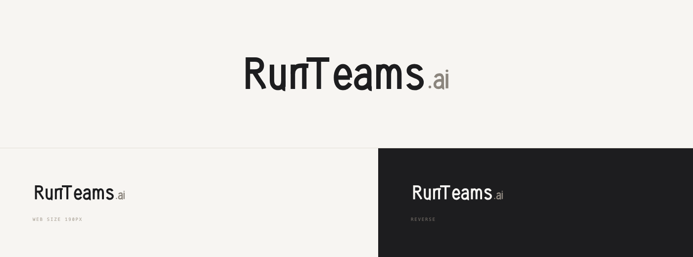
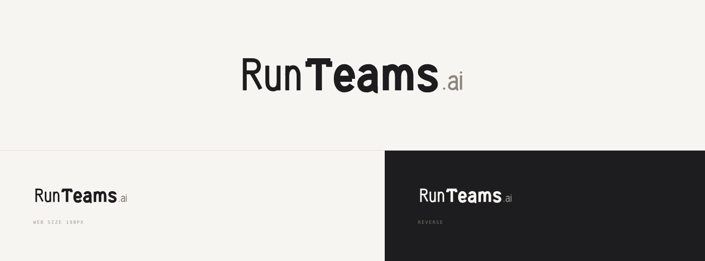
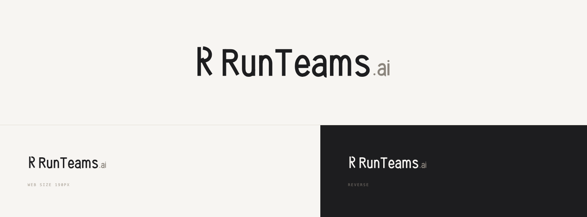

# RunTeams.ai Website Logo — Round 3

Claude Design project: `RunTeams.ai Website Logo R3`
Project ID: `49017aff-e58c-4440-b67e-185537d1e2f6`

This round replaces the app-icon framing from Rounds 1–2 with website-first horizontal marks. Every concept is shown at a large review size, at approximately 190 px website navigation width, and reversed on dark.

## 01 — Handoff Ligature / 交接字标

- Architecture: wordmark only.
- Construction: custom monoline humanist neo-grotesque letterforms. The end of `Run` and the crossbar of `Teams` meet through a small parallel-cut gap, creating a hand-off without an arrow.
- `.ai`: 60% scale, muted warm gray.
- Strength: quietest and most practical navigation logo; the full brand name carries without a separate unknown symbol.
- Risk: the condensed hand-built letterforms need another optical refinement pass, especially `R`, `n`, and the `nT` spacing.

## 02 — Editorial Operator / 编辑式字标

- Architecture: wordmark only with internal weight contrast.
- Construction: `Run` uses a restrained medium weight while `Teams` uses a heavier slab/humanist structure on the same skeleton.
- `.ai`: 58% scale in the lighter weight.
- Strength: more distinctive and more confident than an ordinary SaaS wordmark; communicates that the team, rather than the runtime, is the product.
- Risk: the weight jump can split the name into two visual products. The transition and heavy `T` need refinement before production.

## 03 — Built R / 构建式 R

- Architecture: letterform-as-symbol plus wordmark.
- Construction: a small three-origin `R` sits directly beside a humanist `RunTeams.ai` wordmark, without a containing tile.
- Strength: creates a reusable small brand mark for favicon and compact headers.
- Risk: the symbol and the first letter of the wordmark create a visible `R R` repetition, while the custom symbol is not yet recognizable enough to justify that repetition. This is the weakest candidate in the round.

## Current assessment

`01 Handoff` is the most usable website direction. `02 Editorial` is the more ownable direction if the internal weight contrast can be softened. `03 Built R` should not advance without a fundamental symbol change.
